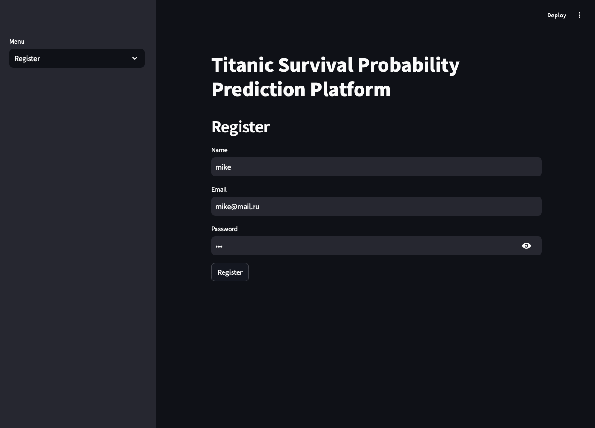
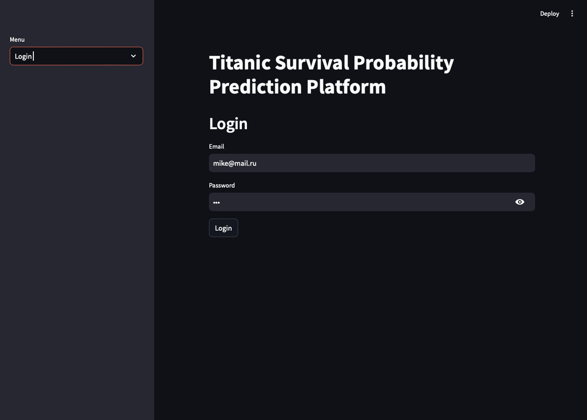
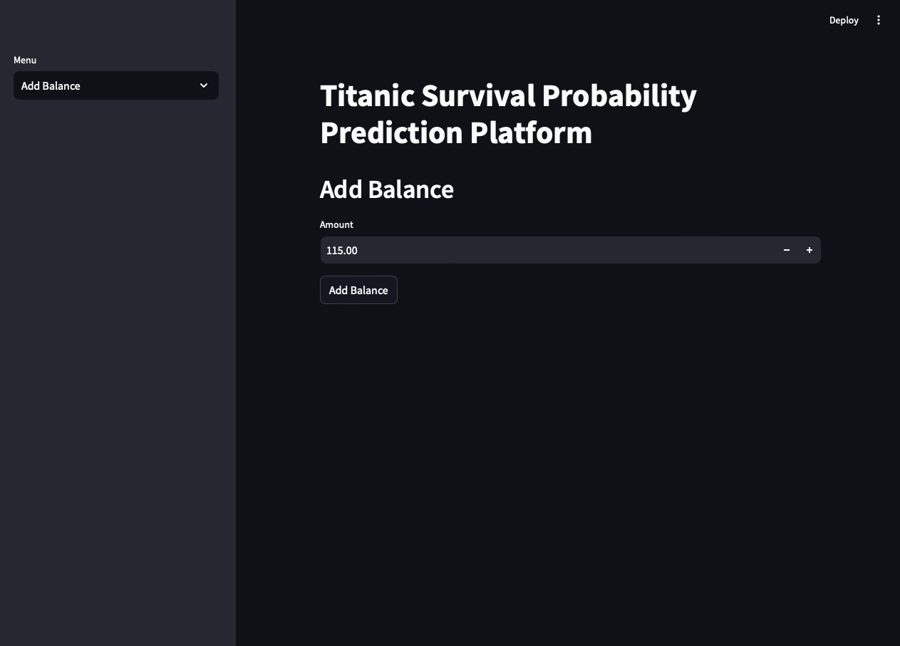
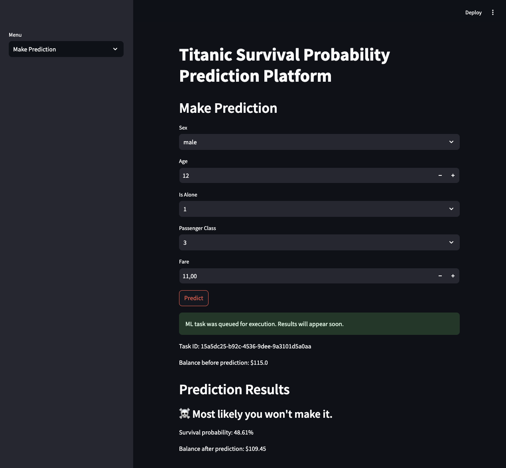
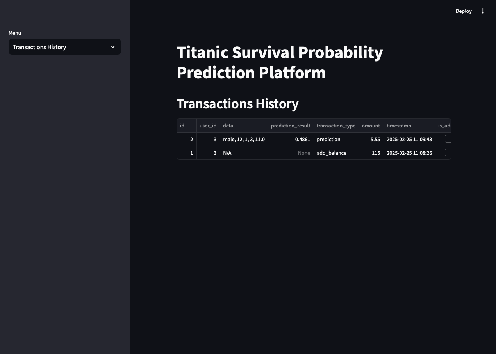
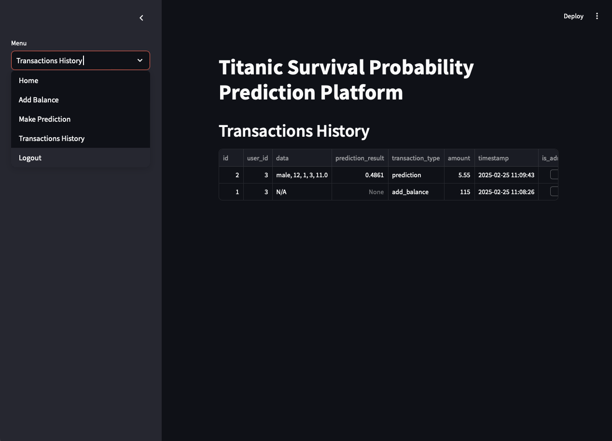
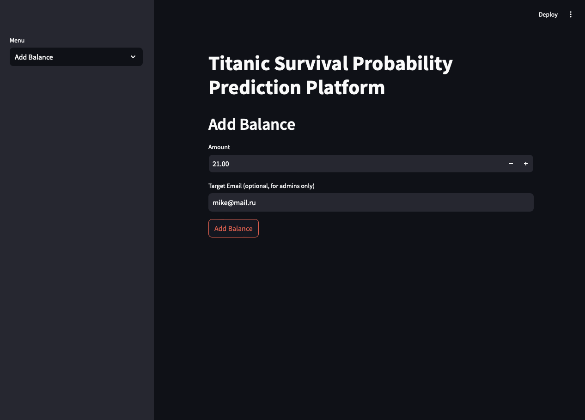

# Titanic Survival Probability Prediction Platform

## Description
The service predicts the probability of survival on the Titanic.  
It is based on a `CatBoostClassifier` model pre-trained on the classic Kaggle dataset.  
The service can create users (regular and administrator).  
Manage balances (add credits).  
An administrator can add credits not only to their own account but also to other users' accounts.  
Users can obtain predictions of the probability of survival on the Titanic based on the information provided.  
Credits are deducted from the user's balance for predictions.  
All transactions can be viewed in the user's transaction history.

## Service Demo

Service demo video --> [watch](https://drive.google.com/file/d/16-rrskCnItbuP_msFyPBaKacVjmwgzoM/view)

## Installation and Launch

1. Clone the service to your computer  
`git clone https://git.lab.karpov.courses/a.nikitin-8/mldev_project.git`
<br></br>

2. Build the Docker image from the root folder of the cloned service  
`docker-compose build`
<br></br>

3. Start the Docker container from the root folder of the cloned service  
`docker-compose up`
<br></br>

4. In a new browser tab, enter the path to the service UI  
`http://localhost:8501/`
<br></br>

5. The service is ready to use  
<br></br>

6. To access the service API documentation, in a new browser tab enter the following path  
`http://0.0.0.0:8080/docs`

## Example of the Application Interface 

1. User registration  

<br></br>

2. User login

<br></br>

3. Add funds - regular user

<br></br>

4. View balance

<br></br>

5. Making predictions

<br></br>

6. View transaction history

<br></br>

7. User logout

<br></br>

8. Add funds - admin user


## API Testing Results

0. he users `kate@mail.ru` and `alex@mail.ru` were created during the service database initialization.
1. Let's check the existing users.   
Curl:
```
curl -X 'GET' \
  'http://0.0.0.0:8080/user/users' \
  -H 'accept: application/json'
```
Response body:
```
[
  {
    "email": "kate@mail.ru",
    "user_name": "kate",
    "password": "$2b$12$5YSNLA8qOHYXIKmpO.aP5OaL9v.O0UrdsG.04XAKbFF7iLdrX3F.O",
    "is_admin": false,
    "user_id": 1
  },
  {
    "email": "alex@mail.ru",
    "user_name": "alex",
    "password": "$2b$12$8GIAfsnuFtu7zNJcbtmd3.8CEb71GaKmrEB9SmAZ9Cjcn.ZnRqYNa",
    "is_admin": true,
    "user_id": 2
  }
]
```
2. Let's check the initial balance of user `kate@mail.ru`.      
Curl:
```
curl -X 'GET' \
  'http://0.0.0.0:8080/balance?email=kate%40mail.ru' \
  -H 'accept: application/json'
```
Response body:
```
{
  "user_id": 1,
  "email": "kate@mail.ru",
  "balance": 0
}
```
3. User `kate@mail.ru` adds `115` credits to her balance.    
Curl:
```
curl -X 'POST' \
  'http://0.0.0.0:8080/balance?email=kate%40mail.ru&amount=115' \
  -H 'accept: application/json' \
  -d ''
```
Response body:
```
{
  "message": "Balance updated successfully.",
  "user_id": 1,
  "email": "kate@mail.ru",
  "new_balance": 115
}
```
4. Let's check `kate@mail.ru` user's balance.    
Curl:
```
curl -X 'GET' \
  'http://0.0.0.0:8080/balance?email=kate%40mail.ru' \
  -H 'accept: application/json'
```
Response body:
```
{
  "user_id": 1,
  "email": "kate@mail.ru",
  "balance": 115
}
```
5. Let's view transactions history for `kate@mail.ru`.      
Curl:
```
curl -X 'GET' \
  'http://0.0.0.0:8080/transactions?email=kate%40mail.ru' \
  -H 'accept: application/json'
```
Response body:
```
{
  "user_id": 1,
  "email": "kate@mail.ru",
  "transactions": [
    {
      "is_admin": false,
      "user_id": 1,
      "data": null,
      "timestamp": "2025-02-23T18:20:19.444202",
      "transaction_type": "add_balance",
      "id": 1,
      "amount": 115,
      "prediction_result": null
    }
  ]
}
```
6. Let's make the first prediction for `kate@mail.ru`.   
Curl:
```
curl -X 'POST' \
  'http://0.0.0.0:8080/prediction?email=kate%40mail.ru&model_name=catboost' \
  -H 'accept: application/json' \
  -H 'Content-Type: application/json' \
  -d '{
  "sex": "female",
  "age": 16,
  "is_alone": "1",
  "pclass": "3",
  "fare": 19.99
}'
```
Response body:
```
{
  "message": "ML task was queued for execution. Check the result in Transactions history.",
  "task_id": "b3199151-9b46-4bae-977d-b3b56713fa43",
  "user_id": 1,
  "email": "kate@mail.ru",
  "balance_before_prediction": 115
}
```
7. Let's make another prediction for `kate@mail.ru` with a different set of input data.  
Curl:
```
curl -X 'POST' \
  'http://0.0.0.0:8080/prediction?email=kate%40mail.ru&model_name=catboost' \
  -H 'accept: application/json' \
  -H 'Content-Type: application/json' \
  -d '{
  "sex": "female",
  "age": 26,
  "is_alone": "0",
  "pclass": "1",
  "fare": 99.99
}'
```
Response body:
```
{
  "message": "ML task was queued for execution. Check the result in Transactions history.",
  "task_id": "2759f665-3831-4d68-a4de-16a276ab7d33",
  "user_id": 1,
  "email": "kate@mail.ru",
  "balance_before_prediction": 109.45
}
```
8. Let's check transactions history for `kate@mail.ru` again.    
Curl:
```
curl -X 'GET' \
  'http://0.0.0.0:8080/transactions?email=kate%40mail.ru' \
  -H 'accept: application/json'
```
Response body:
```
{
  "user_id": 1,
  "email": "kate@mail.ru",
  "transactions": [
    {
      "is_admin": false,
      "user_id": 1,
      "data": null,
      "timestamp": "2025-02-23T18:20:19.444202",
      "transaction_type": "add_balance",
      "id": 1,
      "amount": 115,
      "prediction_result": null
    },
    {
      "is_admin": false,
      "user_id": 1,
      "data": [
        "female",
        16,
        "1",
        "3",
        19.99
      ],
      "timestamp": "2025-02-23T18:26:01.418077",
      "transaction_type": "prediction",
      "id": 2,
      "amount": 5.55,
      "prediction_result": 0.6057572552546867
    },
    {
      "is_admin": false,
      "user_id": 1,
      "data": [
        "female",
        26,
        "0",
        "1",
        99.99
      ],
      "timestamp": "2025-02-23T18:26:01.428580",
      "transaction_type": "prediction",
      "id": 3,
      "amount": 5.55,
      "prediction_result": 0.9724760706826941
    }
  ]
}
```
9. Let's check `kate@mail.ru` balance once again.  
Curl:
```
curl -X 'GET' \
  'http://0.0.0.0:8080/balance?email=kate%40mail.ru' \
  -H 'accept: application/json'
```
Response body:
```
{
  "user_id": 1,
  "email": "kate@mail.ru",
  "balance": 103.9
}
```

## Project Development Stages

### Task 8

Service Demonstration:
- [x] Add a description of how to run the project to README.md
- [x] Create a video recording demonstrating the key functionality of the project.

---

### Task 7

Test the system's functionality, specifically:
- [x] User creation, 
- [x] Adding credits to the balance,
- [x] Making predictions,
- [x] Retrieving transaction history.

---

### Task 6

Develop a Web interface for the application that will interact with the previously built system core and implement all the required functionality from the course assignment:
- [x] User registration, 
- [x] User login,
- [x] Viewing and adding credits to the balance (bonus: an admin can add credits to other users' balances), 
- [x] Making predictions,
- [x] Viewing transaction history (balance top-ups and predictions made),
- [x] User logout.

---

### Task 5

Implement system interaction with the ML service through message passing:
- [x] Deploy several workers, 
- [x] Connect them to RabbitMQ,
- [x] Configure RabbitMQ in a one-publisher-multiple-listeners mode, 
- [x] Workers must receive an ML task, perform a prediction, and record the result of their work,
- [x] Manually test the system's operation using the Rest API.

---

### Task 4

Implement an interface for interacting with the system (REST on FastAPI) containing all the basic system functionality:
- [x] Registration, 
- [x] Authorization,
- [x] Sending data for prediction, 
- [x] Viewing and adding credits to the balance,
- [x] Viewing transaction history.

---

### Task 3

- [x] Connect a database to the application's object model using an ORM framework.
- [x] Test the system's functionality:
  - User creation, 
  - Adding credits to the balance, 
  - Deducting credits from the balance, 
  - Retrieving transaction history, etc.
- [x] Prepare a script to initialize the database with default data (demo user, demo administrator, etc.).

---

### Task 2

- [x] Create 4 services: `app`, `web-proxy`, `rabbitmq`, `database`
- [x] The `app` service is configured via environment variables in an `env_file`
- [x] The source files of the `app` service are mounted via `volumes`
- [x] The `web-proxy` service is based on the `Nginx` image
- [x] The `web-proxy` service depends on the `app` service
- [x] The `web-proxy` service exposes ports `80` and `443`
- [x] The `rabbitmq` service is based on the `rabbitmq` image
- [x] The `rabbitmq` service exposes ports `15672` and `5672`
- [x] A volume is mounted to `/var/lib/rabbitmq` in the `rabbitmq` container to persist the queue across service restarts.
- [x] The `rabbitmq` service is set to restart on failure.
- [x] The `database` service is based on the `postgres` image
- [x] A volume is mounted to the `database` service to persist the database even if the container is removed.  

---

### Task 1

- [x] Identify the core entities the system will work with: User, ML model, transaction/prediction history, ML model task, etc.
- [x] During the design phase, define class names, field names, methods, accepted data types, and access modifiers.
- [x] During the design phase, use all basic OOP principles, namely encapsulation, inheritance for class extension, and polymorphism.
