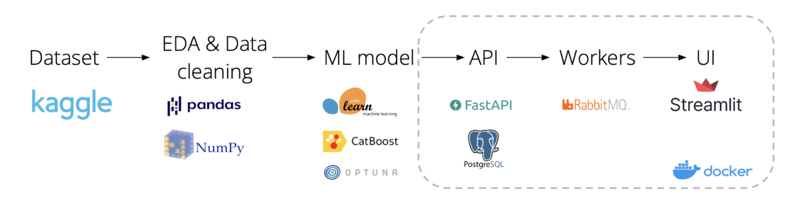
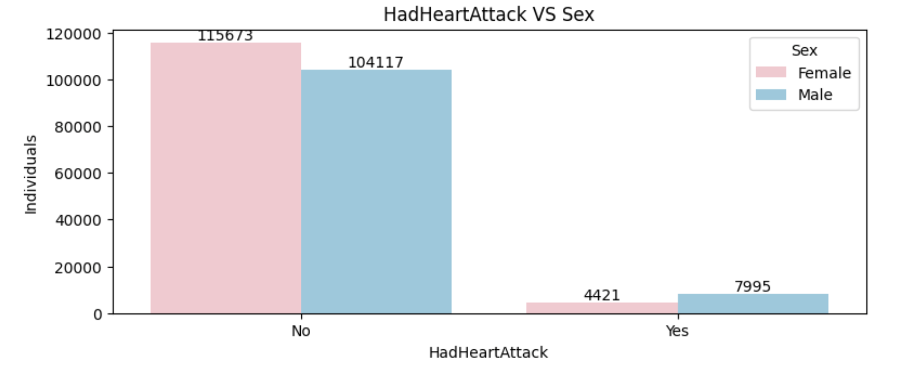
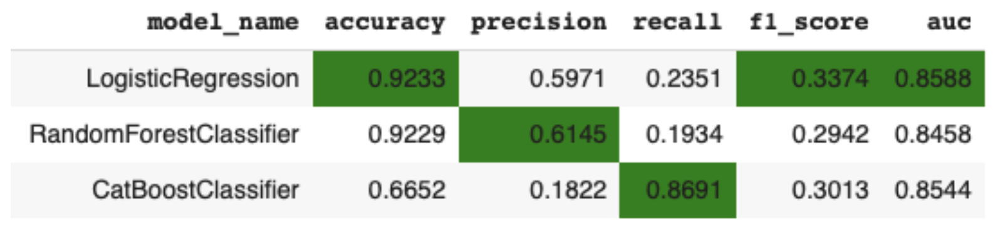
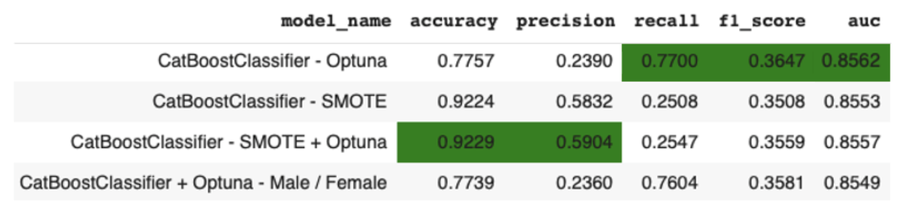
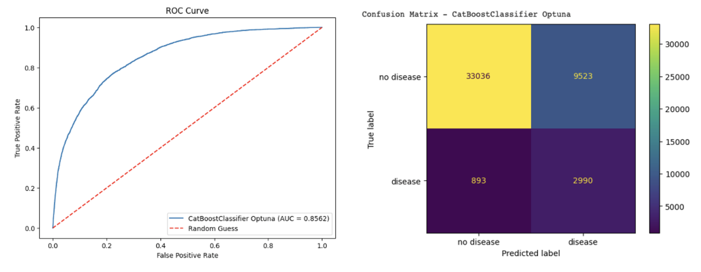

# Feel Good Inc.

## Description

`Feel Good Inc.` is a predictive healthcare service that, based on users’ health information, can predict the probability of developing cardiovascular-related diseases. For users with an elevated risk, the service offers to book a doctor’s appointment or undergo a medical check-up with one of the service’s external partners.

According to the World Health Organization (WHO), cardiovascular diseases are the leading cause of death worldwide.  
Rosstat statistics indicate that in Russia, more than 40% of the population suffers from arterial hypertension.  
With timely diagnosis and lifestyle modification for patients with cardiovascular diseases, serious complications can be avoided.

The developed service helps clients aged 35+ living in fast-paced megacities, who chronically lack time to care for their health, to address the problem of timely prevention of cardiovascular disease risks through artificial intelligence technologies and consultations with highly qualified specialists.

## Service Demo

Service demo video --> [watch](https://drive.google.com/file/d/1AnjpOs1ivEUsLzffZ1tRJ4fszHPQYxy4/view)

## Project schedule


Project start: April 07, 2025.  
Project presentation: July 03, 2025.    
Duration: 12.5 weeks.  

## Technologies



## Dataset

To develop the ML service and train the model, the `2022 annual CDC survey data of 400k+ adults related to their health status` public dataset was used: 
```
curl -L -o ~/Downloads/personal-key-indicators-of-heart-disease.zip\
https://www.kaggle.com/api/v1/datasets/download/kamilpytlak/personal-key-indicators-of-heart-disease
```

## EDA and Data Cleaning

This stage of the project included the following steps:
- data loading
- checking the data for missing values
- checking the data for outliers
- removing the detected outliers
- visualizing data distributions
- searching for patterns and insights in the data. For example, it was found that men have heart attacks more often than women:



Jupyter-notebook with EDA: [click here](https://colab.research.google.com/drive/1peMPQ5Oz5wo43228jzXh6ZZ5oX-72ALi?usp=sharing)

## Baseline Model Selection

At this stage, three different models were tested as a baseline solution: `LogisticRegression`, `RandomForestClassifier` and `CatBoostClassifier`. The results are presented in the comparison table below:



- The `LogisticRegression` model achieved the best Accuracy, F-score, and AUC.
- The `RandomForestClassifier` model showed the best Precision.
- `CatBoostClassifier` significantly outperforms the other models on the Recall metric. At the same time, its AUC value differs from that of the LogisticRegression model only in the third decimal place.
- Recall indicates the proportion of actual positive cases (patients with cardiovascular diseases) that the model correctly identified among all patients with the disease in the sample. In a medical context, missing a positive case is often far more dangerous than incorrectly classifying a healthy patient.
- Therefore, **the `CatBoostClassifier` model was chosen as the final and best model**, as its Recall is nearly 4 times higher than the other models while maintaining a comparable AUC value.

Jupyter-notebook with baseline model selection: [click here](https://colab.research.google.com/drive/1peMPQ5Oz5wo43228jzXh6ZZ5oX-72ALi?usp=sharing)

## Model Quality Improvement
To improve the model's quality, the following approaches were tested:
- `CatBoostClassifier` with hyperparameter tuning using `Optuna`
- `CatBoostClassifier` with class imbalance correction using `SMOTE`
- `CatBoostClassifier` with class imbalance correction using `SMOTE` + hyperparameter tuning with `Optuna`
- Building two separate models for women and men: `CatBoostClassifier` with hyperparameter tuning using `Optuna`



- The model using `SMOTE` and hyperparameter tuning with `Optuna` achieved the best Accuracy and Precision. However, its Recall is significantly weaker.
- The final and best model should be the one with the highest Recall, provided its AUC values are comparable to the other models.
- The `CatBoostClassifier` with hyperparameter tuning via `Optuna` has the highest AUC values.
- Moreover, this same model also showed the highest Recall and F1-score.
- This is the model we will use for our ML service. This way, we will miss the minimum number of genuinely sick people who need a medical consultation. Additionally, this model's AUC will be the highest.



Jupyter-notebook with attempts to improve model's performance: [click here](https://colab.research.google.com/drive/1LvsQhyCEMZmfDPlLRBHH9aM3sIJux1eS?usp=sharing)  

## MVP Service Development Description
The service is built on a modular and scalable architecture using modern technologies to ensure efficiency and ease of deployment, development, evolution, and maintenance.

The FastAPI framework is used to create the endpoints, providing a high-performance backend for processing client requests and managing interactions with the service.

For scaling and load distribution, RabbitMQ is employed as a message broker. This allows for launching the necessary number of ML worker containers to process prediction tasks in parallel, significantly increasing the service's throughput under high load.

The user interface is built with Streamlit, offering a simple and interactive way for users to interact with the service and submit prediction tasks.

All components, including the API, workers, and the interface, are packaged into Docker containers, which makes deploying and scaling the service fast, simple, and convenient.

Prediction results and their associated data are stored in a PostgreSQL database, ensuring reliable data storage.


