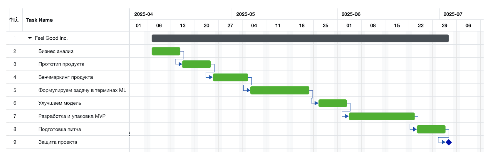

# Feel Good Inc.

## Description

`Feel Good Inc.` is a predictive healthcare service that, based on users’ health information, can predict the probability of developing cardiovascular-related diseases. For users with an elevated risk, the service offers to book a doctor’s appointment or undergo a medical check-up with one of the service’s external partners.

According to the World Health Organization (WHO), cardiovascular diseases are the leading cause of death worldwide.  
Rosstat statistics indicate that in Russia, more than 40% of the population suffers from arterial hypertension.  
With timely diagnosis and lifestyle modification for patients with cardiovascular diseases, serious complications can be avoided.

The developed service helps clients aged 35+ living in fast-paced megacities, who chronically lack time to care for their health, to address the problem of timely prevention of cardiovascular disease risks through artificial intelligence technologies and consultations with highly qualified specialists.

## Service Demo

Service demo video --> [watch](https://drive.google.com/file/d/1AnjpOs1ivEUsLzffZ1tRJ4fszHPQYxy4/view)

## Project schedule

